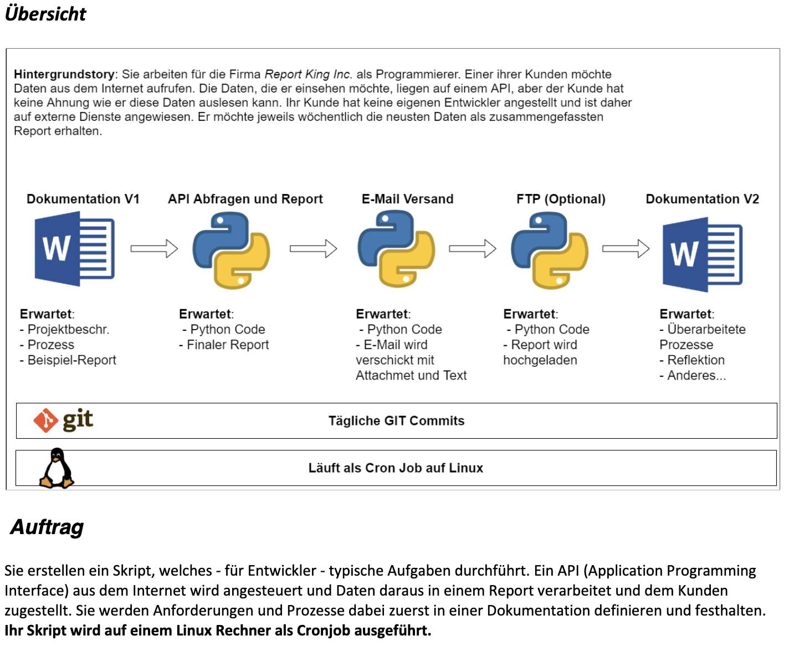

# LB2 - Dokumentation <!-- omit in toc -->

## Inhaltsverzeichnis <!-- omit in toc -->

- [Einführung](#einführung)
- [Beschreibung](#beschreibung)

## Einführung

In diesem Modul haben wir den Auftrag bekommen ein kleines Projekt zu programmieren, das folgendermassen aufgebaut sein soll:

## Beschreibung

Ich werde mithilfe der Coingecko API wöchentlich einen Report erstellen, die jede Woche den Bitcoin Kurs zusammenfassen. Der Report soll folgendermassen aussehen:

<h1>Wöchentlicher Bitcoin Bericht</h1>
<table>
  <tr>
    <th>Datum</th>
    <th>Preis</th>
  </tr>
  <tr>
    <th>14.06.2022</th>
    <td>CHF 22455</td>
  </tr>
  <tr>
    <th>15.06.2022</th>
    <td>CHF 22233</td>
  </tr>
  <tr>
    <th>16.06.2022</th>
    <td>CHF 22414</td>
  </tr>
  <tr>
    <th>17.06.2022</th>
    <td>CHF 19727</td>
  </tr>
  <tr>
    <th>18.06.2022</th>
    <td>CHF 19883</td>
  </tr>
  <tr>
    <th>19.06.2022</th>
    <td>CHF 18492</td>
  </tr>
  <tr>
    <th>20.06.2022</th>
    <td>CHF 19901</td>
  </tr>
  <tr>
    <th>21.06.2022</th>
    <td>CHF 19959</td>
  </tr>
</table>
